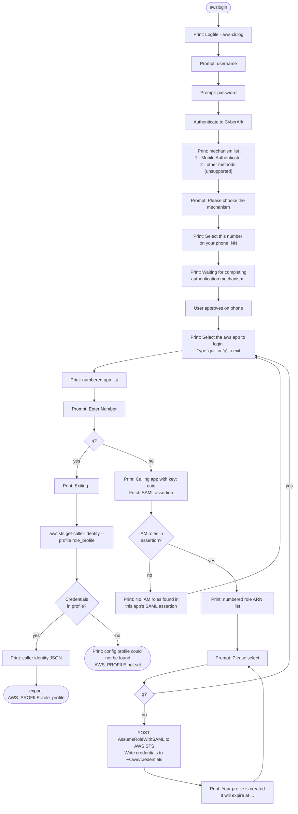

# AWS CLI / Terraform credentials on macOS via CyberArk Identity (SAML)

> **Unsupported community example.** This is a learning and testing aid, provided as-is with no warranty, SLA or support. It is not an official or supported product, tool or reference architecture of any company, including any employer of its contributors, and it is not affiliated with CyberArk or AWS. Review the code before you run it, and use it at your own risk. Issues and pull requests may go unanswered.

Get temporary AWS STS credentials into a named profile so plain `aws` and `terraform` work locally when AWS access is federated through a CyberArk Identity (Idira/Idaptive) app tile.

This applies when clicking the AWS tile lands on `https://signin.aws.amazon.com/saml` (plain IAM SAML federation). If you land on an IAM Identity Center portal instead, use `aws configure sso`; none of this applies.

## Quick start

Requirements: macOS with zsh (Linux, including WSL, should work but is untested, see [Future work](#future-work--todo)), Python 3 (with `venv`), `unzip`, `patch`, and the [AWS CLI](https://aws.amazon.com/cli/).

```bash
./install.sh --tenant <tenant> --region <aws-region> --role <role-name> --zshrc
```

- `--tenant`: your CyberArk tenant, `acme` or the full host `acme.id.cyberark.cloud`.
- `--region`: AWS region written to the profile, e.g. `us-west-2`.
- `--role`: the IAM role **name** you assume (not the ARN), e.g. `my_admin_role`. The tool names the profile `<role-name>_profile`.
- `--zshrc`: append the `source` line to `~/.zshrc`. Omit it to have the line printed instead.
- `--dest <dir>`: install somewhere other than `~/.local/share/cyberark-aws-cli`.

Example with made-up values (substitute yours):

```bash
./install.sh --tenant acme --region us-west-2 --role my_admin_role --zshrc
```

Then open a new terminal and run `awslogin`.

### Where to find your values

| Value | Example (fake) | Where to look |
|---|---|---|
| Tenant | `acme` (`acme.id.cyberark.cloud`) | The host in the URL when you log in to the CyberArk app portal. |
| Role name | `my_admin_role` | The part after `role/` in the ARN the tool lists at the role prompt, e.g. `arn:aws:iam::123456789012:role/my_admin_role`. |
| Region | `us-west-2` | Wherever you normally work in AWS. It only sets the profile's default region; it doesn't affect the login. |
| AWS app | `AWS Example IDP` | The tile in the app portal that opens `signin.aws.amazon.com/saml`. The tool lists every AWS-type app you have. |
| Username | `jdoe` | Your CyberArk login name as entered at the prompt. Here it is the short username, not the email/UPN. Only if the short name is rejected, try the full email. |

Not sure of the role name? Run the tool once with any `--role`, read the ARN list at the role prompt, then re-run `install.sh` with the right name, or set `AWSLOGIN_PROFILE` later.

## How it works



## Using awslogin

1. Enter your short username (not the email/UPN), then your password.
2. Pick **Mobile Authenticator** and tap the number printed as `>>> Select this number on your phone: NN`. Other MFA methods are not supported by this tool.
3. Pick the **IAM SAML** AWS app. An app whose assertion has no IAM roles (typically an Identity Center app) prints an error and returns you to the app menu; just pick a different app.
4. Pick your role. The tool re-prompts after each success; enter `q` to exit.

`awslogin` then runs `aws sts get-caller-identity` and, if that succeeds, exports `AWS_PROFILE=<role-name>_profile` in your shell. Credentials last one hour; run `awslogin` again to refresh.

### Example session (made-up values)

```text
% awslogin
Logfile - aws-cli.log
Please enter your username : jdoe
Password :
1 : Mobile Authenticator
2 : <other method>
Please choose the mechanism : 1

>>> Select this number on your phone: 42

Waiting for completing authentication mechanism..
Select the aws app to login. Type 'quit' or 'q' to exit
1 : AWS Example IDP | 00000000-1111-2222-3333-444444444444
2 : AWS Example GovCloud | 55555555-6666-7777-8888-999999999999
Enter Number : 1
Select a role to login. Choose one role at a time. ...
[ 1 ]:  arn:aws:iam::123456789012:role/my_admin_role
[ 2 ]:  arn:aws:iam::123456789012:role/my_readonly_role
[ 3 ]:  arn:aws:iam::210987654321:role/my_admin_role
Please select : 1
Your profile is created. It will expire at 2030-01-01 12:00:00+00:00
Use --profile my_admin_role_profile for the commands
Please select : q
Enter Number : q
{
    "UserId": "AROAEXAMPLEEXAMPLEXX:jdoe@example.com",
    "Account": "123456789012",
    "Arn": "arn:aws:sts::123456789012:assumed-role/my_admin_role/jdoe@example.com"
}
```

Role names can repeat across accounts (here `my_admin_role` exists in two). The profile is named after the role only, so picking the same role name in a different account overwrites the previous profile. Choose the ARN for the account you want.

Overrides (environment variables): `AWSLOGIN_PROFILE`, `AWSLOGIN_REGION`. Extra arguments are passed to the tool, e.g. `awslogin -d` for debug output.

### Using the profile

```bash
aws s3 ls --profile <role-name>_profile
AWS_PROFILE=<role-name>_profile terraform plan
```

Terraform's AWS provider picks up `AWS_PROFILE` (or `profile = "..."` in the provider block) and reads `~/.aws/credentials`. Role chaining via `assume_role` in a provider block caps sessions at one hour regardless of other settings.

## What is in this repo

| Path | Purpose |
|---|---|
| `aws-cli-utilities-master.zip` | CyberArk's original, unmodified `aws-cli-utilities` (Apache-2.0, see `LICENSE.md` inside). Docs: https://identity-developer.cyberark.com/docs/aws-cli |
| `patches/auth-py-fixes.patch` | Fixes for `core/auth.py` against current CyberArk responses (see below). |
| `patches/samlapp-fixes.patch` | Graceful error for Identity Center apps that have no IAM roles in their SAML assertion (instead of crashing). |
| `patches/samlapp-bounds-fix.patch` | Rejects a role number of zero or below instead of indexing from the end of the list. |
| `patches/auth-global-state-fix.patch` | Returns authentication results from the handlers instead of keeping them in module-level lists. |
| `patches/logging-fixes.patch` | Creates `aws-cli.log` with owner-only permissions, moves request/response/app details from INFO to DEBUG, tightens the app-number check, and exits non-zero when no profile was created. |
| `patches/change-notices.patch` | Adds the Apache-2.0 change notice to every upstream file the other patches modify. Apply last. |
| `awslogin.zsh` | Template for the `awslogin` shell function; `install.sh` fills in the placeholders. |
| `install.sh` | Extracts the zip, applies the patches in order, creates a venv with `boto3 requests colorama`, writes `awslogin.zsh`. Safe to re-run. |
| `AGENTS.md` | Guidance for AI coding agents working in this repo. |
| `LICENSE` | MIT license for the original files in this repo (not the bundled CyberArk code). |
| `NOTICE.md` | Third-party attribution (CyberArk, Apache-2.0), statement of modifications, trademark/affiliation disclaimer. |

### The patches

`auth-py-fixes.patch` is the core fix. The 2022 code breaks against the current API in two ways:

1. **MFA menu crash (`KeyError: 'PromptSelectMech'`).** Some mechanisms have no `PromptSelectMech`, and the menu loop iterates every key of the challenge dict. The patch iterates only `challenge['Mechanisms']` and labels entries with `PromptSelectMech`, falling back to `Name`, then `AnswerType`.
2. **Number matching is never shown.** Mobile Authenticator with `OTPWITHNUMBER: True` returns `Result.GeneratedAuthValue` from the start-OOB call, but the tool polls silently, so you can't tell which number to tap. The patch prints it.

## Manual install (what `install.sh` does)

```bash
DEST="$HOME/.local/share/cyberark-aws-cli"
unzip -q aws-cli-utilities-master.zip "aws-cli-utilities-master/AWS CLI - Idaptive V1/*" -d /tmp/cyberark-aws
mkdir -p "$DEST" && cp -R "/tmp/cyberark-aws/aws-cli-utilities-master/AWS CLI - Idaptive V1/." "$DEST/"
for p in auth-py-fixes samlapp-fixes logging-fixes auth-global-state-fix samlapp-bounds-fix change-notices; do
  patch -p1 -d "$DEST" < "patches/$p.patch"   # order matters
done
python3 -m venv "$DEST/.venv" && "$DEST/.venv/bin/pip" install boto3 requests colorama
```

Then copy `awslogin.zsh` to `$DEST/`, replace `<tenant>`, `<region>` and `<role-name>`, and `source` it from `~/.zshrc`. The tool must run from its own directory (it reads `proxy.properties` and writes `aws-cli.log` there), which the function handles with `cd`.

## Troubleshooting

| Symptom | Cause / fix |
|---|---|
| `KeyError: 'PromptSelectMech'` | Unpatched `auth.py`. Re-run `install.sh`. |
| MFA hangs on "Waiting for completing authentication mechanism" | You chose a method other than Mobile Authenticator. Ctrl-C, re-run, pick Mobile Authenticator. |
| No number shown for Mobile Authenticator | Unpatched `auth.py`. Re-run `install.sh`. |
| "No IAM roles found in this app's SAML assertion" | That app is likely an Identity Center app. The tool returns you to the app menu — pick a different one. |
| `Access Denied` from `AssumeRoleWithSAML` | The role isn't trusted for your SAML provider or you picked the wrong role. Check the ARN list. |
| `aws: [ERROR]: The config profile (...) could not be found` right after a failed login | Harmless. The tool exits 0 on failure, so the follow-up check ran anyway. |
| Expired credentials | They last one hour. Run `awslogin` again. |
| Wrong profile name | The tool names it `<role>_profile` from the role you picked. Set `AWSLOGIN_PROFILE`. |

## Security notes

- Don't commit or paste STS credentials. They live only in `~/.aws/credentials`, and `aws-cli.log` (git-ignored) can contain session details.
- The tool rewrites `~/.aws/credentials` through a config parser: existing profiles are kept, comments are dropped.
- Don't copy EC2 instance-role credentials to a laptop (GuardDuty flags it as credential exfiltration), and don't create long-lived IAM user keys for this.
- Longer sessions need an admin to raise the role's `MaxSessionDuration` and the `SessionDuration` SAML attribute.

## Future work / TODO

**Linux and shell portability** (developed and tested on macOS only)
- The Python tool is cross-platform; `msvcrt` is imported only on Windows and is unused elsewhere. `install.sh` uses only POSIX-style tools.
- Debian/Ubuntu need `python3-venv` (`apt install python3-venv unzip patch`); `install.sh` should detect a missing `ensurepip` and say so.
- `install.sh --zshrc` only knows `~/.zshrc`. Add bash support (`--rc <file>` or shell auto-detect) and rename the function file to `awslogin.sh`; the function body is already bash-compatible.
- Test on a Linux container and add the result to Requirements.
- WSL counts as Linux (WSL1 or WSL2); the tool is terminal-only, so no browser integration is needed. Things to document and test:
  - Credentials land in the WSL home (`~/.aws/credentials`), not the Windows profile, so a Windows-side `aws.exe` or Terraform won't see them. Options: run `aws`/`terraform` inside WSL, or point `AWS_SHARED_CREDENTIALS_FILE` at a shared path.
  - Install under the Linux filesystem (`~/.local/share/...`), not `/mnt/c/...`: it is faster and avoids permission problems with `chmod 600`.
  - Clone the repo with LF line endings (`.gitattributes` with `*.sh text eol=lf`), or `install.sh` can fail with `\r` errors.
  - Confirm the system clock stays in sync after WSL2 sleep/resume, since SAML assertions and STS are time-sensitive.
- Native Windows is out of scope (upstream ships a PowerShell variant, unused here); use WSL.

**Hardening and first-run fixes**
- The tool does `open(~/.aws/credentials, 'w+')`: it fails if `~/.aws` doesn't exist, and a newly created file gets umask permissions (often `0644`). Have `install.sh` create `~/.aws` as `0700` and an empty credentials file as `0600` if absent.
- Include the account ID in the profile name (e.g. `<account>-<role>`) so the same role name in two accounts doesn't overwrite one profile.
- Add an `uninstall.sh` (the manual steps are in Uninstall).

**Convenience**
- One-pass login: pre-select the AWS app and role ARN (env vars such as `AWSLOGIN_APP` / `AWSLOGIN_ROLE_ARN`) and exit after one login instead of re-prompting.

**Maintenance**
- CI: `shellcheck` on `install.sh`, `bash -n` / `zsh -n`, and a `patch --dry-run` against the zip, so a bad patch is caught before it ships.
- Watch upstream (CyberArk `aws-cli-utilities`) in case it fixes the MFA menu and number display, which would make the patch unnecessary.
- Revisit [saml2aws](https://github.com/Versent/saml2aws) with the Browser provider once its pinned Playwright driver download works again; it would remove the Python tool entirely. Last tried with 2.36.19 (driver download returned 404).

## License

Original files in this repo are MIT-licensed (`LICENSE`). The bundled CyberArk `aws-cli-utilities` is Apache-2.0, Copyright 2019 CyberArk, LLC, and is redistributed unmodified in the zip; the patches change several upstream files and each patched file carries a change notice (see `NOTICE.md`). This project is independent and not affiliated with or endorsed by CyberArk or AWS.

## Uninstall

```bash
rm -rf ~/.local/share/cyberark-aws-cli
# remove the `source .../awslogin.zsh` line from ~/.zshrc
# remove the [<role-name>_profile] section from ~/.aws/credentials
```
